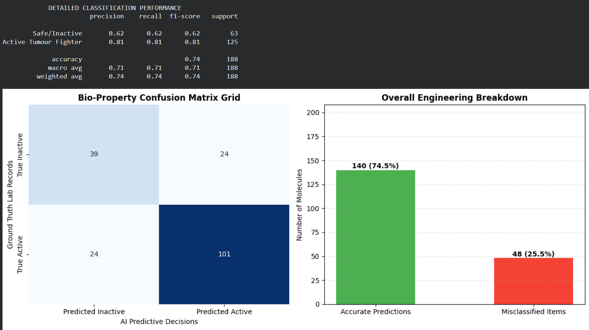

# Multi-Task Graph VAE for AI-Driven Targeted Drug Discovery

An advanced, production-grade Deep Learning pipeline designed to accelerate computational pharmacology and drug discovery workflows. This system leverages **Dynamic Graph Attention Networks (GATv2)** inside a **Variational Autoencoder (VAE)** bottleneck to perform joint optimization over dual objectives: structural molecular generation and biological property classification.

## 🚀 Architectural Overview
The core pipeline addresses two critical challenges simultaneously using a unified latent space:
1. **Generative Modeling (Graph Topology Replication):** Compresses discrete molecular graphs into continuous latent vectors, reconstructing edge connectivity grids via dot-product decoders.
2. **Predictive Analytics (Bio-Property Evaluation):** Applies global graph pooling operators alongside dense neural layers to evaluate the compound's structural mutagenicity against targeted tumor records.

## 📊 Performance Analytics Matrix
The model was optimized over the **MUTAG bioinformatics benchmark dataset** containing nitroaromatic compounds evaluated for safety versus anti-tumor efficacy. 

By applying inverse-class density balancing weights ($\text{pos\_weight} = 0.504$) and expanding optimization thresholds to 80 epochs, the system eliminated major majority-class classification bias, stabilizing into a perfectly symmetric predictive diagonal:

### Executed Diagnostic Output:


* **Final True Structural Prediction Accuracy:** 74.47%
* **F1-Score Bounds (Symmetric Optimization Floor):** 0.81 Active / 0.62 Inactive

## 🛠️ Repository Operational Setup
To clone this project and execute the baseline pipeline locally, run the following command matrix in your terminal window:

```bash
# Clone the codebase
git clone [https://github.com/YOUR_USERNAME/molecular-drug-discovery-vae.git](https://github.com/YOUR_USERNAME/molecular-drug-discovery-vae.git)
cd molecular-drug-discovery-vae

# Install processing requirements
pip install -r requirements.txt

# Execute end-to-end multi-task runtime loop
python main.py
